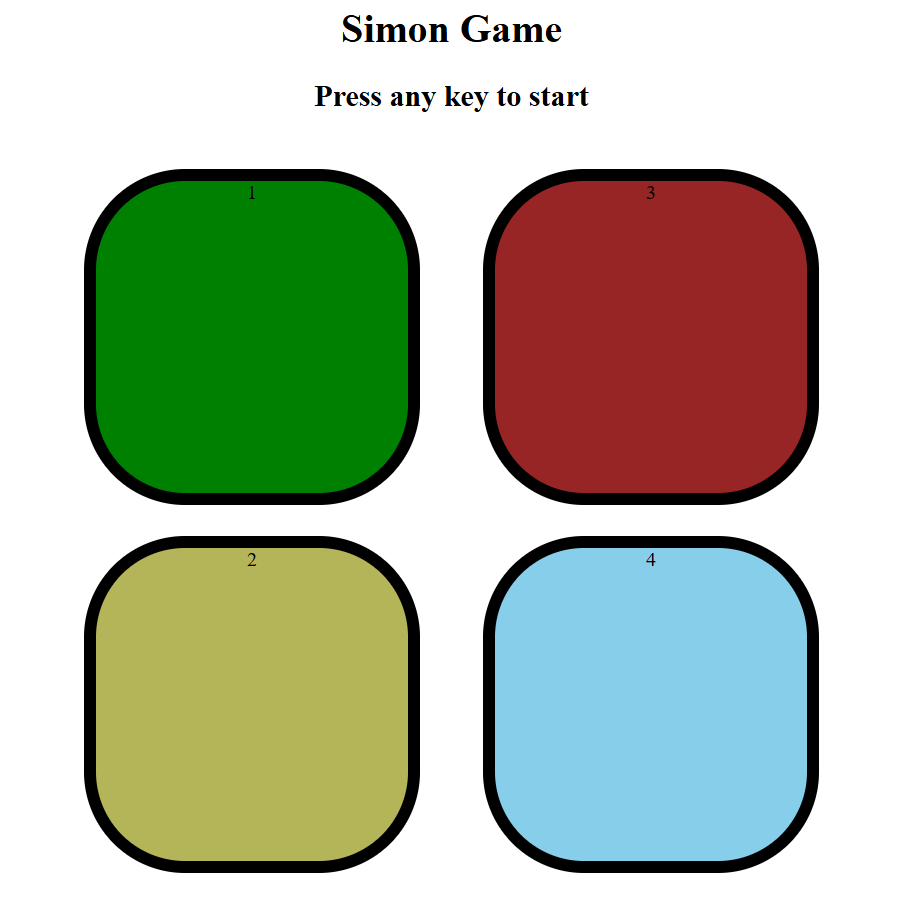

# Simon Says Web Game

A simple web-based version of the classic Simon Says game. Players must memorize and repeat a sequence of colors. Built using HTML, CSS, and JavaScript.

## Features
- Interactive color buttons
- Increasing difficulty with each level
- Score tracking
- Responsive design for desktop

## How to Play
1. Press any key to begin the game.
2. Watch the sequence of colors displayed by the game.
3. Repeat the sequence by clicking the corresponding color buttons.
4. If you repeat the sequence correctly, the game will add one more step.
5. Keep playing until you make a mistake. Try to beat your highest score!

## Technologies
- HTML
- CSS
- JavaScript

## Screenshot


## How to Run Locally
1. Clone this repository:  
   ```bash
   git clone https://github.com/Sneha28-p/simon-says-webdev.git
2. Open simon.html in your web browser.
